# Helm Pratiği ve Öğrenimi Projesi

Projeyi çalıştırmadan önce bilgisayarınızda aşağıdaki araçların kurulu olması gerekmektedir:

Proje; **Vagrant** üzerinde sanallaştırılan, **Ansible** ile configure edilen ve **K3s** üzerinde çalışan bir yapıyı kapsar.Helm öğrenimi ve pratikleri amacıyla bu proje yapılmıştır.

##  Ön Gereksinimler (Prerequisites)
Projeyi çalıştırmadan önce bilgisayarınızda aşağıdaki araçların kurulu olması gerekmektedir:

* [Vagrant](https://www.vagrantup.com/)
* [VirtualBox](https://www.virtualbox.org/)
* [Ansible](https://docs.ansible.com/ansible/latest/installation_guide/intro_installation.html)


## Kurulum Adımları (Installation)

### 1. Sanal Makineyi Başlatma
Vagrant ortamını ayağa kaldırın. Bu işlem `192.168.56.30` IP adresinde bir Ubuntu sanal makinesi oluşturacaktır.

```bash
vagrant up
```

##  Altyapı ve K3s Kurulumu (Ansible)

Aşağıdaki Ansible playbook’larını **sırasıyla** çalıştırarak sunucuyu hazırlayın, K3s’i kurun ve hello-world uygulamasının imajını build edin.

# 1. İşletim sistemi hazırlığı 
```bash
ansible-playbook -i inventory.ini playbooks/prepare.yaml
```

# 2. K3s Kurulumu ve config ayarları 
```bash
ansible-playbook -i inventory.ini playbooks/install-k3s.yaml 
```


Bu projede Helm pratiği yapmak amacıyla **NGINX** chart’ı seçilmiştir (nginx / redis seçenekleri arasından nginx tercih edilmiştir).


## Helm Repository Ekleme
Makineye SSH ile bağlantı sağlanmıştır , Bitnami Helm repository’si Helm’e eklenmiştir:

```bash
helm repo add bitnami https://charts.bitnami.com/bitnami
```
## Chart İndirme ve Hazırlık
NGINX chart’ı, values.yaml dosyası üzerinde değişiklik yapılabilmesi ve chart yapısının incelenebilmesi amacıyla lokal ortama indirilmiş ve extract edilmiştir:

```bash
helm pull bitnami/nginx --untar
```
## Kubeconfig ayarlanması 
Helmin uygulanması için kubeconfig ayarının varsayılan olarak localhost:8080 adresi değil /etc/rancher/k3s/k3s.yaml konumuna bakmasını söylüyoruz
```bash
export KUBECONFIG=/etc/rancher/k3s/k3s.yaml
```

## Uygulamanın Yüklenmesi

İndirilen yerel klasör (./nginx) kaynak gösterilerek kurulum yapılmıştır. Bu aşamada varsayılan ayarlar kullanılmıştır:

```bash
helm install my-nginx ./nginx --namespace default
```

## Doğrulama
Nginx podlarını doğruluyoru:


Kurulumun durumu helm list komutu ile kontrol edilmiştir:

```bash
root@mert-k3slab-server:/home/vagrant/helm-practice/nginx# helm list
NAME        NAMESPACE   REVISION    UPDATED                                 STATUS      CHART           APP VERSION
my-nginx    default     2           2026-01-14 15:41:16.590279955 +0000 UTC deployed    nginx-22.4.3    1.29.4
```


## Soru: Helm status komutu çıktısındaki "Notes" bölümü ne işe yarar?

http://suyog942.medium.com/demystifying-helm-a-practical-guide-to-notes-txt-9acdb111fb6a 
bu makaleyi aldım baz olarak helm status notes bölümü  chartName/templates/NOTES.txt dosyasındaki bilgileri yazıyor genel olarak benim nginx deploymentimda chart name , chart versiyon ve sadece app versiyonum yazıyordu benim helm status notes kısmım dolayısıyla aşşağıdaki gibi.

## Bu Projedeki Çıktı
Kullandığım bitnami/nginx chart'ının bu sürümünde NOTES.txt çıktısı şu şekildedir:
```bash
NOTES:
CHART NAME: nginx
CHART VERSION: 22.4.3
APP VERSION: 1.29.4 
```

## Yapılandırma ve "Values.yaml"


Öncesinde values.yaml dosyamda replica sayım 1 ve resources kısmım tamamen default olarak :
```bash
    Limits:
      cpu:                150m
      ephemeral-storage:  2Gi
      memory:             192Mi
    Requests:
      cpu:                100m
      ephemeral-storage:  50Mi
      memory:             128Mi
```

değerlerine sahipti kubectl describe pod komudu ile bunları gördüm. 


Sonrasında ise values.yaml dosyamı değiştirerek bu değerleri istenen değerler gibi güncelledim.


Ve şu sonuçları gördüm.Bu sonuçlar ile başarılı bir şekilde güncelleme işlemlerimi yapmış oldum 
Güncelleme işlemlerini yaparken şu komudu kullandım:
```bash
 helm upgrade my-nginx ./nginx 
```


## Kendi Chart'ını Oluşturma (Deep Dive)


Repomda bulunan hello-app klasörünün altında python flask ile kurmuş olduğum istek attığım zaman "Hello World! Kubernetes ve Helm çalışıyor" responsesini veren uygulama ile Dockerfile sini yazdım

Daha sonrasında helm ile templatesini kurmadan öncesinde:


Yeni bir ansible dosyası kurmam gerekti. Bu sayede helm chart ile kullanabileceğim hello-app uygulamamın imagesini Vm`in içerisine koymuş oldum.

```bash
ansible-playbook -i inventory.ini playbooks/build-app.yaml
```

Daha sonrasında komudu ile templatemi oluşturdum.

```bash
helm create hello-app 
```

Helm lint komudunun çıktısı:


```bash
helm install hello-world-app ./hello-app
```
bu komut ile uygulamamı ayağa kaldırdım. 


##  Release Yönetimi ve Geri Dönüş (Rollback)
Nginxin bozulması için nginx chartındaki values.yaml dosyasındaki image kısmındaki nginx yazısı yerine nginxx yaparak test ettim.


Daha sonrasında şu komut ile release yönetimi için nginximin releaselerine baktım:

```bash
helm history my-nginx
```


Daha sonrasında şu komut ile tam bir önceki versiyona döndüm spesifik olarak bir versiyon belirtmeden 
```bash
helm rollback my-nginx 1
```


ve sonrasında ise nginx podlarım yeniden çalışmaya devam etti.

##  Final Projesi (Full Stack)


Öncelikli olarak şu komut ile wordpress repomu çektim 
```bash
helm pull bitnami/wordpress --untar
```
Daha sonrasında şu komut ile wordpress podlarımı kurdum default values ayarları ile.

```bash
helm install my-blog ./wordpress
```
Burada ise podlar gözüküyor.


##  Veritabanı şifresini düz metin olarak değil, bir Secret objesi üzerinden Helm ile deploy edin. 

Burada ise charts/wordpress/templates altına externaldb-secret.yaml dosyamı yani secret.yamlımı kurdum.


Daha sonrasında ise values.yaml altında mariadb ayarlarını değiştirerek external secretten database şifresinin gelmesini sağladım.

Güncellediğim values.yaml dosyasıyla şu komutla güncelledim birdaha wordpress deploymentimi.

```bash
helm install my-blog ./wordpress
```

Secrete baktığım zaman ise base 64 ile şifrelenmiş bir şekilde mariadb-password ve wordpress-passwordumu görmüş oldum 


Wordpress uygulamamı ise şöyle çalıştırdım 

```bash
root@mert-k3slab-server:/home/vagrant/helm-practice# kubectl port-forward svc/my-blog-wordpress 8080:80 --address 0.0.0.0^
```

böyle yaparak kendi bilgisayarımda ulaşabildim wordpresse http ile ssl olmadan.


## Worldpress'e DNS tanımlayın ve HTTPS  çalışmasını sağlayın.

Bu projede güvenli bağlantı (HTTPS) sağlamak için manuel sertifika üretimi yerine, Kubernetes dünyasının standardı olan cert-manager kullanılmıştır. Bu sayede sertifikalar kod deposunda  saklanmaz, küme içerisinde otomatik olarak üretilir ve yönetilir
# 1.  cert-manager Kurulumu

Sertifika yöneticisini (Certificate Manager) kümeye dahil etmek için aşağıdaki komutlar çalıştırılır:

```bash
helm repo add jetstack https://charts.jetstack.io
helm repo update

helm install cert-manager jetstack/cert-manager \
  --namespace cert-manager \
  --create-namespace \
  --set installCRDs=true
```
# 2. Self-Signed Issuer Tanımlama
Sertifikaları imzalayacak olan yerel otoriteyi (Issuer) oluşturmak için ClusterIssuer tanımı uyguladım.

# 3. WordPress Ingress Ayarları

values.yaml dosyasında Ingress yapılandırması, cert-manager'ı tetikleyecek şekilde ayarlanmıştır. Gizli anahtarlar (Private Keys) dosyada bulunmaz.

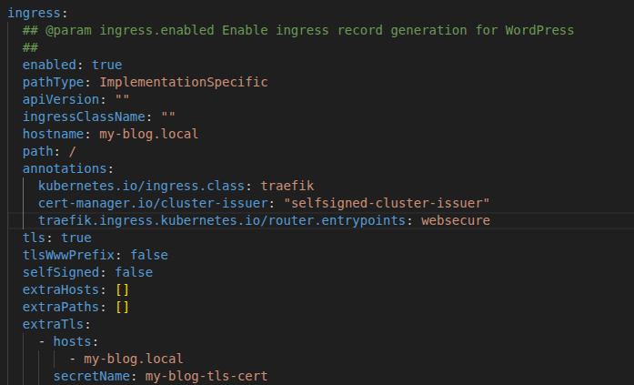

daha sonrasında kendi bilgisayarıma port-forward yaptığım için kendi bilgisayarımda hostu tanımlamam gerekti 


daha sonrasında ise 

```bash
root@mert-k3slab-server:/home/vagrant/helm-practice/wordpress# kubectl port-forward svc/my-blog-wordpress 8080:80 --address 0.0.0.0
```

komudunu çalıştırdıktan sonra kendi bilgisayarımda gittiğim zaman adresi https şeklinde görmüş oldum 


## Helm Pratiği CI/CD Bölümü

Projenin CI/CD süreçlerinin sağlıklı çalışabilmesi için K3s Cluster'ı ve GitHub Runner'ların, Private Harbor Registry ile güvenli bir şekilde iletişim kurması gerekir.

# Auto-Scale olabilen GitHub Actions Runnerları

Kubernetes üzerinde çalışan  Auto-Scalable runner'lar kurgulanmıştır.

Bunun için **Actions Runner Controller** kullanılmıştır.

1. **Actions Runner Controller :** GitHub Actions için Kubernetes operatörüdür. Kubernetes cluster'ı içinde çalışır ve GitHub ile konuşarak iş yükünü yönetir.

2. **gha-runner-scale-set-controller:** ARC'nin beynidir. GitHub API'leri ile sürekli iletişim halindedir. Bir `workflow_job` kuyruğa düştüğünde bunu algılar ve Kubernetes'e "Bana acil yeni bir Pod oluştur!" emrini verir.

## Çalışma Mantığı

* **Tetiklenme:** GitHub'a bir kod pushlandığında veya PR açıldığında bir Workflow tetiklenir.
* **Algılama:** Cluster'da çalışan `gha-runner-scale-set-controller`, bu iş isteğini yakalar.
* **Ölçeklenme :** Controller, `RunnerScaleSet` tanımına bakarak dinamik olarak yeni bir Runner Pod'u oluşturur.
* **Çalıştırma:** Pod ayağa kalkar, kodu çeker , testleri/buildleri  yapar.
* **Temizlik :** İş bittiğinde o Pod tamamen silinir. Bir sonraki iş için yepyeni, temiz bir Pod oluşturulur.

```bash
helm repo add actions-runner-controller https://actions-runner-controller.github.io/actions-runner-controller
```

```bash
helm install arc ./charts/gha-runner-scale-set-controller \
    --namespace arc-systems 
```

```bash
helm install arc-runner-set ./charts/gha-runner-scale-set \
    --namespace arc-systems
```
Podlarımız şuan hazır namespacemizde

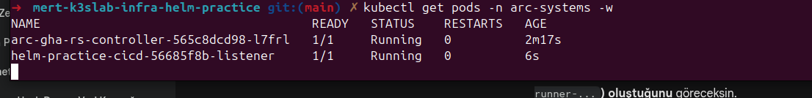

# Harbor Kurulumu

## Kısaca Harbor Nedir ?
Basitçe; Docker Hub'ın kendi sunucumuzda çalışan, tamamen bize ait, güvenli ve çok daha yetenekli versiyonudur. İmajları tarayabilir , imzalayabilir ve erişim kontrolü sağlar.

## CI/CD Akışındaki Şu ana kadarki Yeri
* **GitHub Runner:** Kodu derler, Docker imajını oluşturur ve Harbor'a push'lar.
* **Harbor:** İmajı depolar ve versiyonlar (tagging).

```bash
helm pull harbor/harbor --untar
```

```bash
helm install harbor ./charts/harbor \
  --namespace harbor-system \
  -f ./charts/harbor/values-local.yaml
```

```bash
KUBECONFIG=./k3s.yaml kubectl port-forward svc/harbor -n harbor-system 8082:443
```

## Harbor Proje Bitimindeki Hali

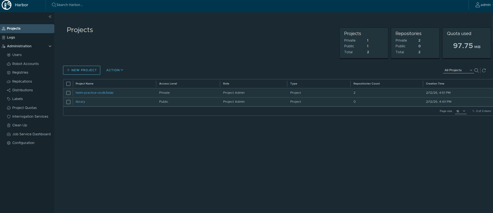

## ArgoCD Kurulumu

## ArgoCD Nedir ve Ne İşe Yarar?

ArgoCD, Kubernetes için geliştirilmiş CD aracıdır.

Basitçe; ArgoCD bizim Cluster Bekçimizdir. Sürekli olarak GitHub repomuzu izler ve repoda tanımladığımız Helm Chart ile Kubernetes cluster'ında çalışan gerçek durum arasında bir fark olup olmadığını kontrol eder.

## Kurulum Ve UI

```bash
helm pull argo/argo-cd --untar 
```

```bash
helm install argocd ./charts/argo-cd \
  --namespace argocd \
  --create-namespace \
  -f ./charts/argo-cd/values-local.yaml
```

```bash
KUBECONFIG=./k3s.yaml kubectl -n argocd port-forward --address 0.0.0.0 svc/argocd-server 8082:80
```

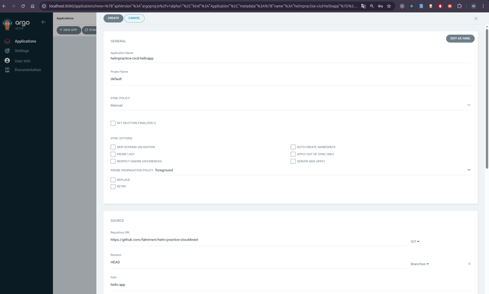

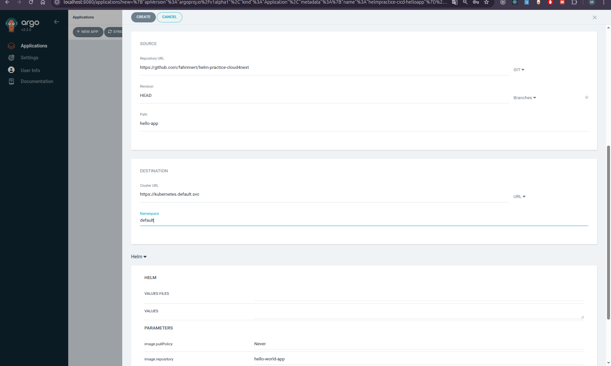

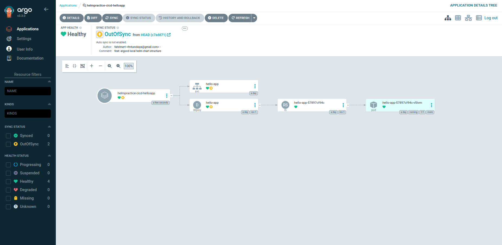

## GitHub Actions Workflowum

Pipeline, Build and Deploy Hello App adıyla tanımlanmıştır ve GitOps prensiplerine sadık kalarak, imajı oluşturduktan sonra Helm Chart'ın versiyonunu otomatik olarak günceller.

## Tetiklenme Mekanizması 
Workflow, kaynakların verimli kullanılması için akıllı filtreleme yapar:

* **Event:** Sadece main dalına yapılan push işlemlerinde çalışır.
* **Path Filter:** Sadece uygulama kaynak kodunda (`src/hello-world-app/**`) veya Helm Chart dosyalarında (`hello-app/**`) bir değişiklik olduğunda tetiklenir. README güncellemeleri pipeline'ı boşuna çalıştırmaz.

Workflow şu adımları sırasıyla gerçekleştirir:

* **Versiyonlama:**
Git commit hash'inin ilk 7 karakterini (örn: `a1b2c3d`) alır. Bu, bizim Docker Image Tag'imiz olur. Böylece her kod değişikliği benzersiz bir versiyona sahip olur.

* **Harbor Login & Build:**
GitHub Secrets içinde saklanan kullanıcı bilgileriyle yerel Harbor Registry'ye giriş yapar.
`docker build` komutu ile imajı oluşturur ve etiketler: `10.0.2.15:30002/proje/hello-app:a1b2c3d`.
İmajı Harbor'a push eder.

# GitOps Manifest Güncellemesi 

İmaj yüklendikten sonra, ArgoCD'nin bu değişikliği fark etmesi için Helm Chart'ın `values.yaml` dosyasının güncellenmesi gerekir.

`sed` komutu ile `values.yaml` içindeki `tag:` satırını bulur ve yeni Short SHA ile değiştirir.

## Commit & Push Back

Güncellenen `values.yaml` dosyasını `git commit` ile kaydeder ve repoya geri push eder.

Bu işlem, pipeline'ın görevini tamamladığı ve topu ArgoCD'ye attığı andır.

## Örnek akış Hello App için

Burada yazan değer v3 den v6 ya değiştirildi.

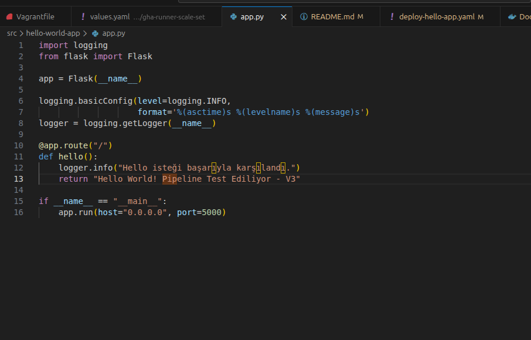

GitHub Actions pipeline'ı tetiklenerek, Docker imajı güncel versiyon etiketi  ile derlendi ve otomatik olarak Harbor'a push etti. Workflow başarıyla tamamlandıktan sonra  saat 03:13 itibarıyla yeni imajın Harbor repository'sine eklendiğini görüldü.
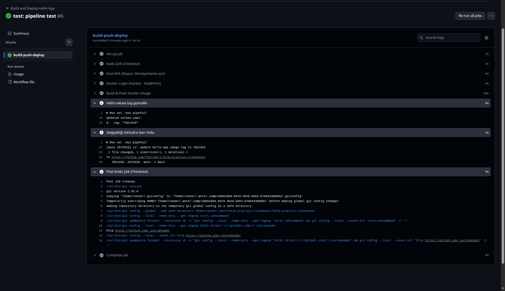

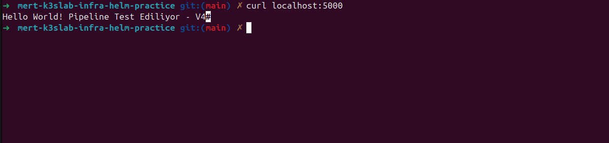

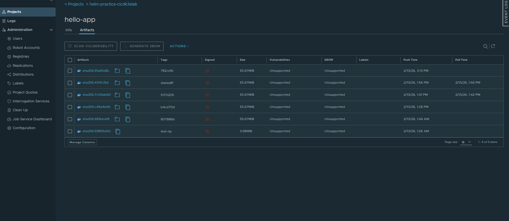

# Sürecin Son Aşaması

* **ArgoCD Senkronizasyonu:** GitHub reposundaki manifest değişikliği ArgoCD üzerinden tetiklenerek , yeni imajın cluster'a dağıtımı başlatıldı.
* **Pod Yenilenmesi:** Kubernetes, eski podları sonlandırıp yeni versiyonlu imajı içeren podları ayağa kaldırdı.
* **Doğrulama:** Oluşan yeni podlara gönderilen `curl` istekleri, güncel versiyonun çalıştığını teyit edildi.

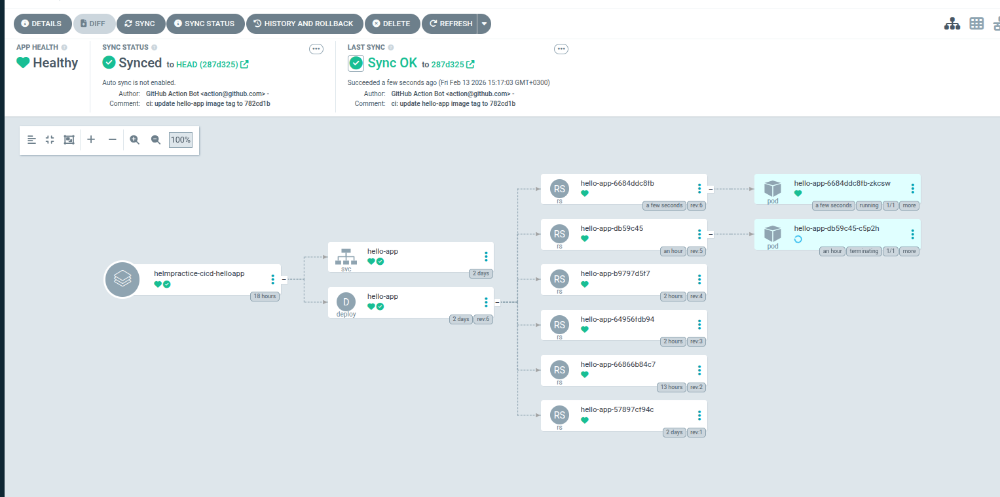

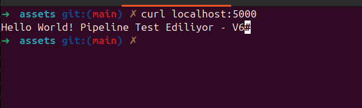

## Örnek akış Wordpress için

Burada yazan değer v3 den v4 ye değiştirildi.Replica sayısı veya chartta herhangi birşey değiştirilince de bu akış çalışırdı.

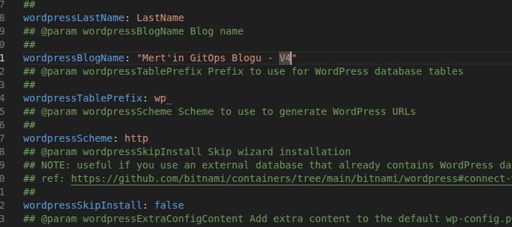

GitHub Actions test-branch branchi ile pipeline'ı tetiklenerek, Docker imajı güncel versiyon etiketi  ile derlendi ve otomatik olarak Harbor'a push etti. Workflow başarıyla tamamlandıktan sonra yeni imajın Harbor repository'sine eklendiğini görüldü.
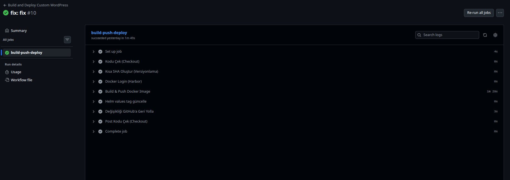


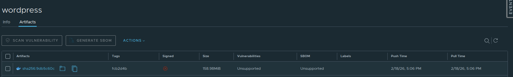

# Sürecin Son Aşaması

* **ArgoCD Senkronizasyonu:** GitHub reposundaki manifest değişikliği ArgoCD üzerinden tetiklenerek , yeni imajın cluster'a dağıtımı başlatıldı.
* **Pod Yenilenmesi:** Kubernetes, eski podları sonlandırıp yeni versiyonlu imajı içeren podları ayağa kaldırdı.

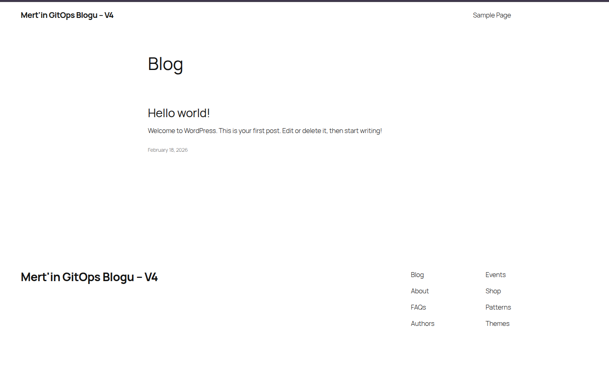

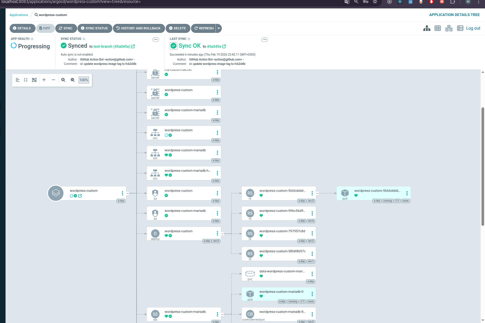

## Ek görev

# Harbor İmaj Temizliği ve Yaşam Döngüsü

## 1. Mantıksal Temizlik: Tag Retention Policy 
Harbor arayüzü üzerinden projeye özel bir **Saklama Politikası** tanımlanmıştır.

* **Kural:** Son **60 gün** içinde pushlanmamış veya aktif kullanılmayan imaj etiketleri otomatik olarak silinir.
* **Sonuç:** Bu işlem imajları diskten silmez, sadece onları "etiketsiz" (**untagged/orphan**) hale getirir.

## 2. Fiziksel Temizlik: Garbage Collection (Helm)
Etiketi silinen ve "kimsesiz" kalan imaj katmanlarının diskten fiziksel olarak silinip yer açılması için **Garbage Collector (GC)** zamanlanmıştır.

Bu ayar, Harbor'ın `values.yaml` dosyası üzerinden Kubernetes CronJob seviyesinde yapılandırılmıştır:

```yaml
gc:
  enabled: true
  schedule: "0 2 * * *"

```
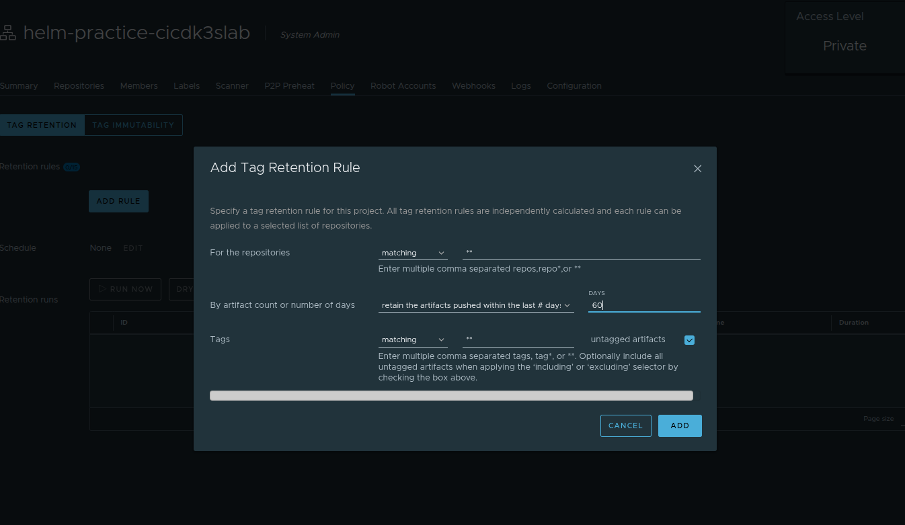

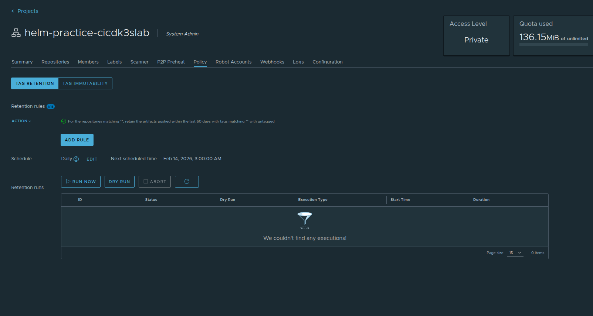