# Helm Pratiği ve Öğrenimi Projesi

Projeyi çalıştırmadan önce bilgisayarınızda aşağıdaki araçların kurulu olması gerekmektedir:

Proje; **Vagrant** üzerinde sanallaştırılan, **Ansible** ile configure edilen ve **K3s** üzerinde çalışan bir yapıyı kapsar.Helm öğrenimi ve pratikleri amacıyla bu proje yapılmıştır.

##  Ön Gereksinimler (Prerequisites)
Projeyi çalıştırmadan önce bilgisayarınızda aşağıdaki araçların kurulu olması gerekmektedir:

* [Vagrant](https://www.vagrantup.com/)
* [VirtualBox](https://www.virtualbox.org/)
* [Ansible](https://docs.ansible.com/ansible/latest/installation_guide/intro_installation.html)


## Kurulum Adımları (Installation)

### 1. Sanal Makineyi Başlatma
Vagrant ortamını ayağa kaldırın. Bu işlem `192.168.56.30` IP adresinde bir Ubuntu sanal makinesi oluşturacaktır.

```bash
vagrant up
```

##  Altyapı ve K3s Kurulumu (Ansible)

Aşağıdaki Ansible playbook’larını **sırasıyla** çalıştırarak sunucuyu hazırlayın, K3s’i kurun ve hello-world uygulamasının imajını build edin.

# 1. İşletim sistemi hazırlığı 
```bash
ansible-playbook -i inventory.ini playbooks/prepare.yaml
```

# 2. K3s Kurulumu ve config ayarları 
```bash
ansible-playbook -i inventory.ini playbooks/install-k3s.yaml 
```

# 3. Python Hello-world uygulamasını build et ve K3s containerd'ye import et
```bash
ansible-playbook -i inventory.ini playbooks/build-app.yaml
```

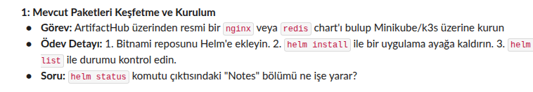

Bu projede Helm pratiği yapmak amacıyla **NGINX** chart’ı seçilmiştir (nginx / redis seçenekleri arasından nginx tercih edilmiştir).


## Helm Repository Ekleme
Makineye SSH ile bağlantı sağlanmıştır , Bitnami Helm repository’si Helm’e eklenmiştir:

```bash
helm repo add bitnami https://charts.bitnami.com/bitnami
```
## Chart İndirme ve Hazırlık
NGINX chart’ı, values.yaml dosyası üzerinde değişiklik yapılabilmesi ve chart yapısının incelenebilmesi amacıyla lokal ortama indirilmiş ve extract edilmiştir:

```bash
helm pull bitnami/nginx --untar
```
## Kubeconfig ayarlanması 
Helmin uygulanması için kubeconfig ayarının varsayılan olarak localhost:8080 adresi değil /etc/rancher/k3s/k3s.yaml konumuna bakmasını söylüyoruz
```bash
export KUBECONFIG=/etc/rancher/k3s/k3s.yaml
```

## Uygulamanın Yüklenmesi

İndirilen yerel klasör (./nginx) kaynak gösterilerek kurulum yapılmıştır. Bu aşamada varsayılan ayarlar kullanılmıştır:

```bash
helm install my-nginx ./nginx --namespace default
```

## Doğrulama
Nginx podlarını doğruluyoru:
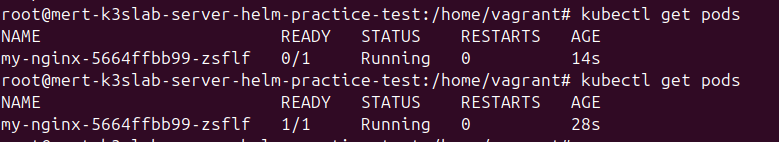

Kurulumun durumu helm list komutu ile kontrol edilmiştir:

```bash
root@mert-k3slab-server:/home/vagrant/helm-practice/nginx# helm list
NAME        NAMESPACE   REVISION    UPDATED                                 STATUS      CHART           APP VERSION
my-nginx    default     2           2026-01-14 15:41:16.590279955 +0000 UTC deployed    nginx-22.4.3    1.29.4
```


## Soru: Helm status komutu çıktısındaki "Notes" bölümü ne işe yarar?

http://suyog942.medium.com/demystifying-helm-a-practical-guide-to-notes-txt-9acdb111fb6a 
bu makaleyi aldım baz olarak helm status notes bölümü  chartName/templates/NOTES.txt dosyasındaki bilgileri yazıyor genel olarak benim nginx deploymentimda chart name , chart versiyon ve sadece app versiyonum yazıyordu benim helm status notes kısmım dolayısıyla aşşağıdaki gibi.

## Bu Projedeki Çıktı
Kullandığım bitnami/nginx chart'ının bu sürümünde NOTES.txt çıktısı şu şekildedir:
```bash
NOTES:
CHART NAME: nginx
CHART VERSION: 22.4.3
APP VERSION: 1.29.4 
```

## Yapılandırma ve "Values.yaml"
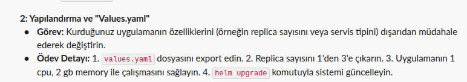

Öncesinde values.yaml dosyamda replica sayım 1 ve resources kısmım tamamen default olarak :
```bash
    Limits:
      cpu:                150m
      ephemeral-storage:  2Gi
      memory:             192Mi
    Requests:
      cpu:                100m
      ephemeral-storage:  50Mi
      memory:             128Mi
```

değerlerine sahipti kubectl describe pod komudu ile bunları gördüm. 

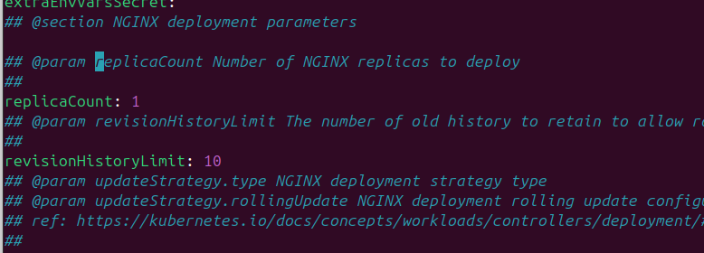

Sonrasında ise values.yaml dosyamı değiştirerek bu değerleri istenen değerler gibi güncelledim.

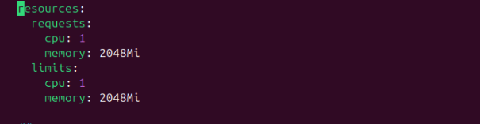

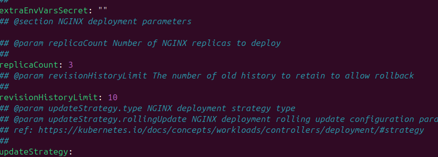

Ve şu sonuçları gördüm.Bu sonuçlar ile başarılı bir şekilde güncelleme işlemlerimi yapmış oldum 
Güncelleme işlemlerini yaparken şu komudu kullandım:
```bash
 helm upgrade my-nginx ./nginx 
```
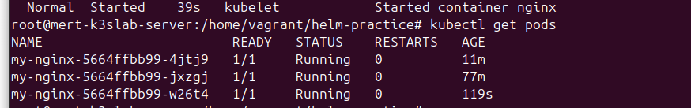

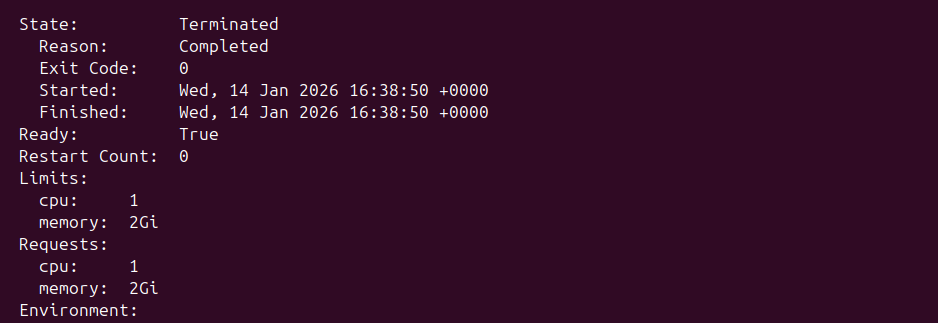

## Kendi Chart'ını Oluşturma (Deep Dive)

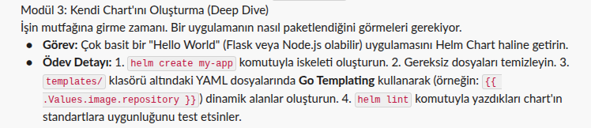

Repomda bulunan hello-app klasörünün altında python flask ile kurmuş olduğum istek attığım zaman "Hello World! Kubernetes ve Helm çalışıyor" responsesini veren uygulama ile Dockerfile sini yazdım

Daha sonrasında helm ile templatesini kurmadan öncesinde:
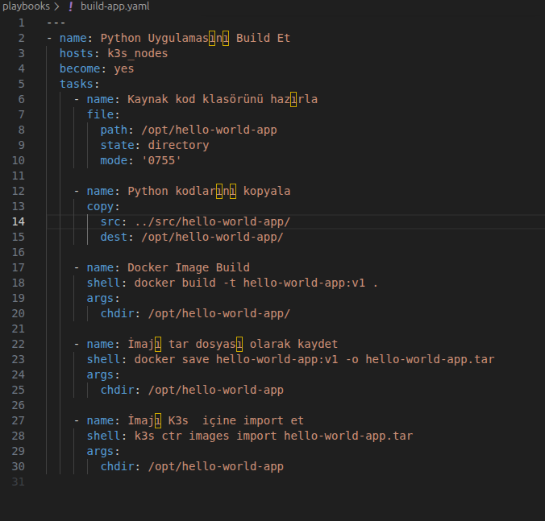

Yeni bir ansible dosyası kurmam gerekti. Bu sayede helm chart ile kullanabileceğim hello-app uygulamamın imagesini Vm`in içerisine koymuş oldum.

Daha sonrasında komudu ile templatemi oluşturdum.

```bash
helm create hello-app 
```

Helm lint komudunun çıktısı:
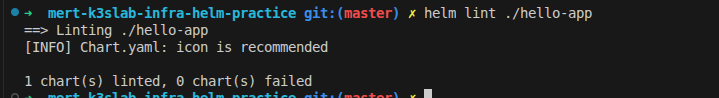

```bash
helm install hello-world-app ./hello-app
```
bu komut ile uygulamamı ayağa kaldırdım. 

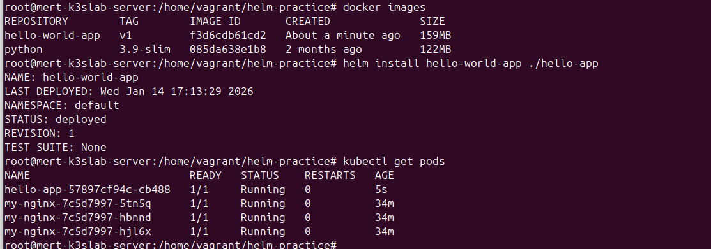

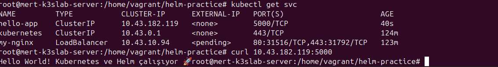


##  Release Yönetimi ve Geri Dönüş (Rollback)
Nginxin bozulması için nginx chartındaki values.yaml dosyasındaki image kısmındaki nginx yazısı yerine nginxx yaparak test ettim.

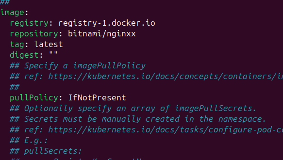

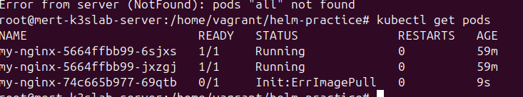

Daha sonrasında şu komut ile release yönetimi için nginximin releaselerine baktım:

```bash
helm history my-nginx
```

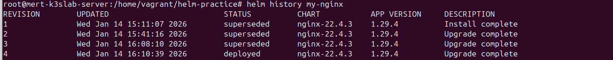

Daha sonrasında şu komut ile tam bir önceki versiyona döndüm spesifik olarak bir versiyon belirtmeden 
```bash
helm rollback my-nginx 1
```

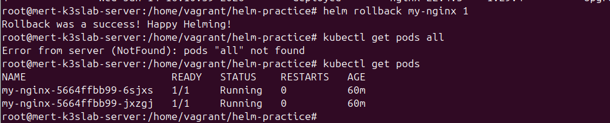

ve sonrasında ise nginx podlarım yeniden çalışmaya devam etti.

##  Final Projesi (Full Stack)
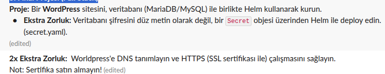

Öncelikli olarak şu komut ile wordpress repomu çektim 
```bash
helm pull bitnami/wordpress --untar
```
Daha sonrasında şu komut ile wordpress podlarımı kurdum default values ayarları ile.

```bash
helm install my-blog ./wordpress
```
Burada ise podlar gözüküyor.
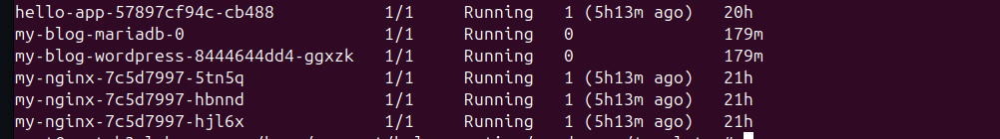

##  Veritabanı şifresini düz metin olarak değil, bir Secret objesi üzerinden Helm ile deploy edin. 

Burada ise charts/wordpress/templates altına externaldb-secret.yaml dosyamı yani secret.yamlımı kurdum.
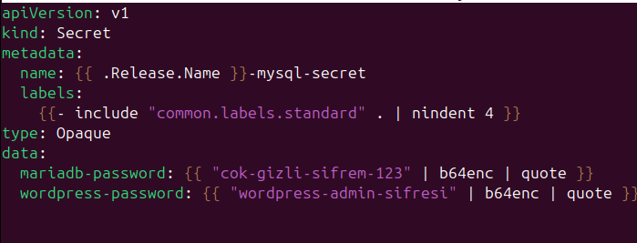


Daha sonrasında ise values.yaml altında mariadb ayarlarını değiştirerek external secretten database şifresinin gelmesini sağladım.

Güncellediğim values.yaml dosyasıyla şu komutla güncelledim birdaha wordpress deploymentimi.

```bash
helm install my-blog ./wordpress
```

Secrete baktığım zaman ise base 64 ile şifrelenmiş bir şekilde mariadb-password ve wordpress-passwordumu görmüş oldum 

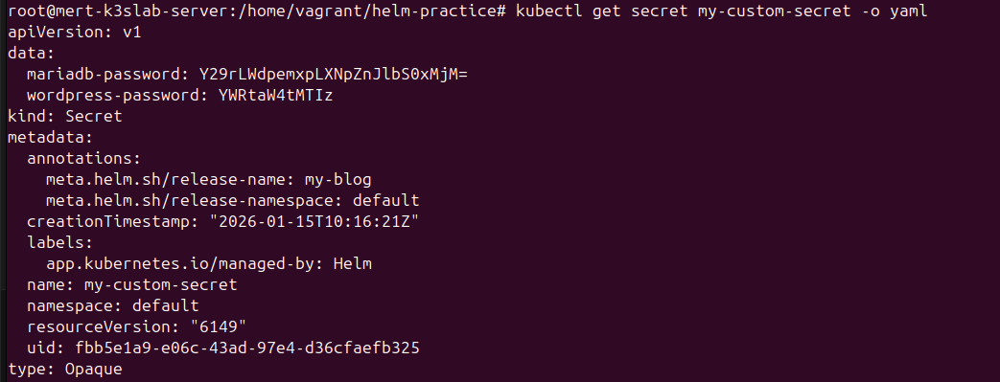

Wordpress uygulamamı ise şöyle çalıştırdım 

```bash
root@mert-k3slab-server:/home/vagrant/helm-practice# kubectl port-forward svc/my-blog-wordpress 8080:80 --address 0.0.0.0^
```

böyle yaparak kendi bilgisayarımda ulaşabildim wordpresse http ile ssl olmadan.

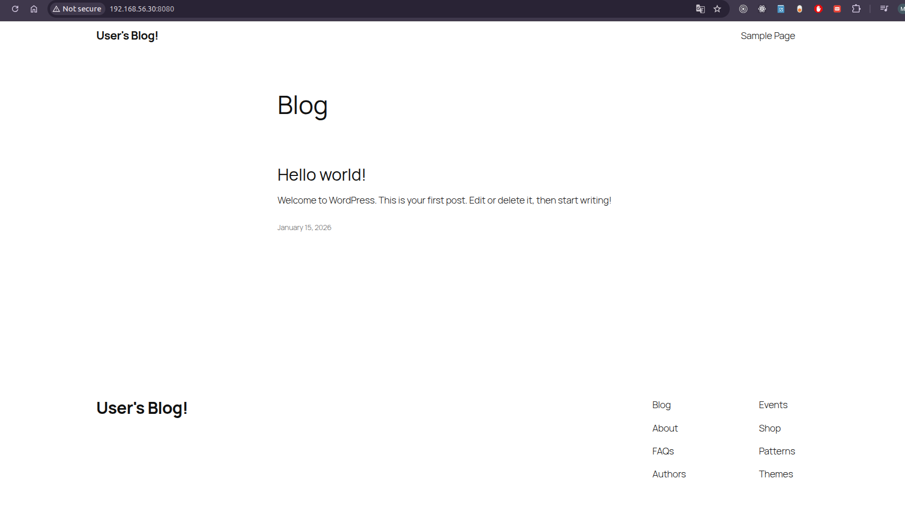


## Worldpress'e DNS tanımlayın ve HTTPS  çalışmasını sağlayın.

Öncelikli olarak şu kodu çalıştırarak kendi sertifikamı ürettim vagrant makinemin içerisinde vagrant makineme ssh yaparak.

```bash
openssl req -x509 -nodes -days 365 -newkey rsa:2048 \
  -keyout tls.key \
  -out tls.crt \
  -subj "/CN=my-blog.local/O=MertLab"
```
bu sertifikayı ürettikten sonrasında helm içerisinde kalmayı seçtiğim için wordpress values.yaml ayarlarımı güncelledim tls kullanmak üzere secret üzerinden.daha sonrasında birdaha helm upgrade çalıştırdım 

daha sonrasında kendi bilgisayarıma port-forward yaptığım için kendi bilgisayarımda hostu tanımlamam gerekti 

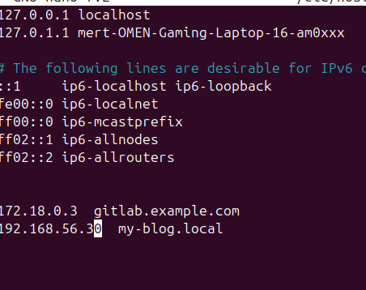

daha sonrasında ise 

```bash
root@mert-k3slab-server:/home/vagrant/helm-practice/wordpress# kubectl port-forward svc/my-blog-wordpress 8080:80 --address 0.0.0.0
```

komudunu çalıştırdıktan sonra kendi bilgisayarımda gittiğim zaman adresi https şeklinde görmüş oldum 

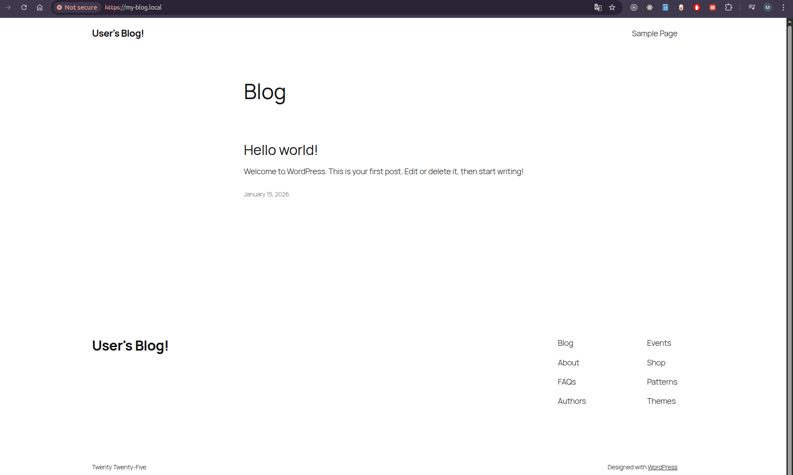